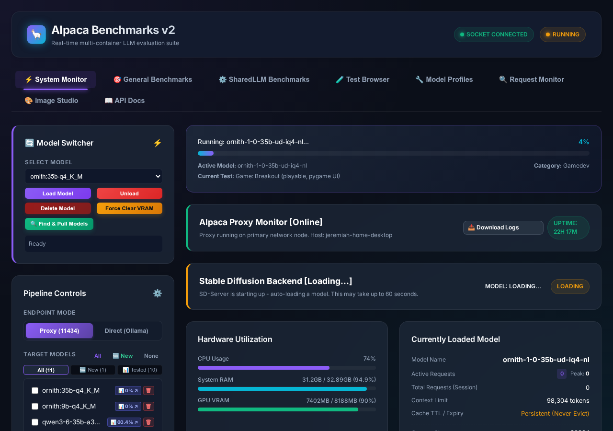
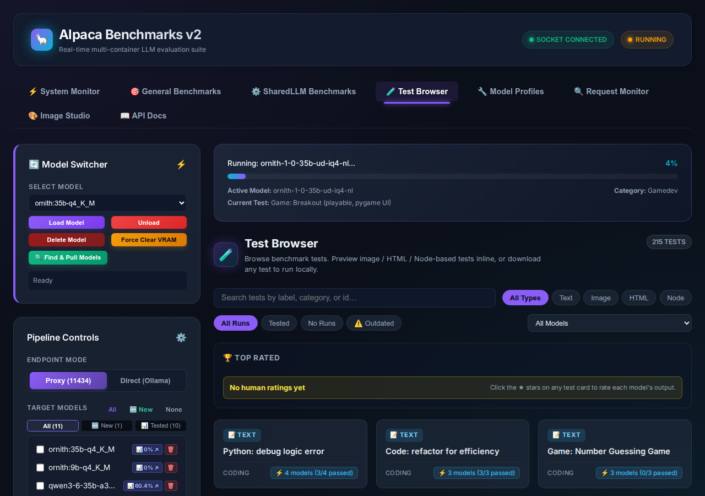
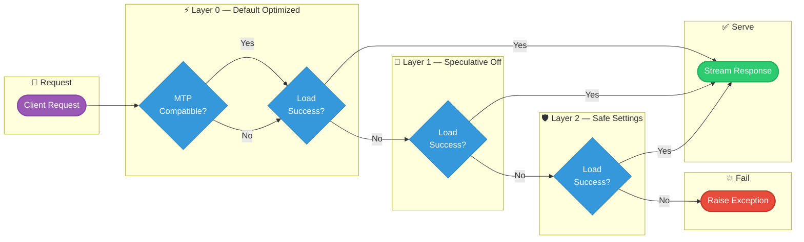

# Alpaca

Alpaca is an Ollama-compatible proxy in front of `llama.cpp` router mode.

The design goal is:

- keep the client-facing API close to Ollama
- keep `llama.cpp` strengths available, including `grammar`, `json_schema`, and lower-level runtime controls
- avoid model switching by mutating Compose or restarting the backend container

## Architecture

- `llama-server` runs as a long-lived router-mode process
- models are discovered from the local Ollama-style manifest/blob store
- the proxy loads and unloads backend models through `llama.cpp` router APIs
- Ollama-style `keep_alive` is enforced in the proxy

This means Alpaca can behave like Ollama from the client perspective while still only keeping one model resident if VRAM is tight.

## Components

- `alpaca-proxy.py`: FastAPI router proxy on port `11434` (Ollama and OpenAI API compatibility, slot allocation, smart request queueing)
- `web/app.py`: Web Dashboard, live monitor, model manager, and benchmark orchestrator on port `5000`
- `llm_benchmark_suite.py`: Comprehensive 213-test benchmark runner with unified 0-100 scoring, AST syntax verification, AI watermark analysis, and out-of-date test detection
- `sandbox_exec.py`: Secure non-root containerized execution and live web app serving engine (`alpaca-sandbox`)
- `online_providers.py`: Multi-provider adapter querying OpenRouter, Hugging Face, Cloudflare Workers AI, and OpenCode Zen
- `telemetry_monitor.py`: Async daemon monitoring real-time VRAM, DRAM, and slot allocations
- `alpaca-puller.py`: Standalone CLI and backend tool for pulling from the Ollama Registry and Hugging Face GGUF repositories
- `docker-compose.yml`: Multi-service deployment definition (llama-server, sd-server, alpaca-proxy, alpaca-web, alpaca-telemetry, alpaca-indexer)

## Screenshots

The web dashboard renders screenshots of every benchmark's output — UI games (pygame), HTML5 canvas, three.js, and raw WebGL apps are captured headless in Chromium and shown inline on each test card. Click any thumbnail to open a full-screen lightbox.

### Dashboard home (▶ Run General / ⚠ Run Outdated controls, model grid, monitor)



### Test Browser (213 tests, model filter, preview modal)



### Rendered benchmark output — real screenshots from actual runs

| Screenshot | Source |
|---|---|
| `game_pong.png` | `kwaipilot-kat-coder-v2-5-dev-iq4-nl` — pygame Pong |
| `retro_space_invaders.png` | `kwaipilot-kat-coder-v2-5-dev-iq4-nl` — retro Space Invaders |
| `game_falling_sand.png` | `kwaipilot-kat-coder-v2-5-dev-iq4-nl` — falling-sand simulation |


### Other screenshot features

- **Benchmark results** — each test card shows a rendered screenshot (when available) plus the model score, pass/fail status, and code execution details.
- **Test Browser** — browse all 213 tests by category/kind/status, filter by model, and preview a test's prompt, expected output, and live-rendered HTML/3D output in a sandboxed iframe (with an "Open in new tab" option).
- **Live monitor** — real-time VRAM/RAM/context telemetry per model with slot allocation and request queueing.
- **Human aesthetic ratings** — give each model a 1–5 star rating per test from the test preview modal; each card shows the highest-rated model (name, score, and rating), and a **Top Rated** board ranks winners per category and overall.

To capture screenshots yourself, run a benchmark from the dashboard (▶ Run General / ⚠ Run Outdated) — rendered output is stored alongside each result in `data/llm_benchmarks/models/general_<model>.json`. New dashboard screenshots can be taken with Playwright (`node_modules/playwright-core`):

```bash
node -e "
import('/node_modules/playwright-core').then(async ({ chromium }) => {
  const b = await chromium.launch({ headless: true, args: ['--no-sandbox'] });
  const p = await b.newPage({ viewport: { width: 1280, height: 900 } });
  await p.goto('http://localhost:5000/', { waitUntil: 'domcontentloaded' });
  await p.screenshot({ path: 'docs/screenshots/dashboard_home.png' });
  await b.close();
});
"
```

## Model Lifecycle

Alpaca now uses `llama.cpp` router-mode APIs instead of rewriting `docker-compose.yml`.

Current lifecycle:

1. Client requests `/api/chat` or `/api/generate` with a `model`.
2. Proxy resolves that model against local manifests and router-visible backend IDs.
3. If `MAX_LOADED_MODELS=1`, the proxy unloads any other loaded backend model first.
4. Proxy calls router `POST /models/load` when the requested model is not already loaded.
5. After the response, the proxy applies Ollama-style `keep_alive` behavior.

Supported `keep_alive` behavior:

- finite durations such as `5m` or `3600`
- `0` to unload immediately after the response
- negative values such as `-1` to keep the model loaded indefinitely

To guarantee high availability and eliminate manual troubleshooting when loading diverse models (such as large context base models vs. speculative draft models), Alpaca features a three-tiered progressive dynamic self-healing pipeline:



### Self-Healing Tiers
1. **Tier-1: Speculative Decoding (MTP) Bypass**:
   - If a model (like `qwen3.6-35b-a3b` or `qwen3.5:9b`) is loaded while `llama-server` has speculative decoding enabled globally, loading will immediately crash the server if the model lacks matching MTP layers.
   - The proxy intercepts the request crash, registers the model's backend filename in `.mtp_incompatible_models.json` (saved in the shared router folder), waits for the server container to auto-restart healthy, and retries loading with `spec_type="none"`.
2. **Tier-2: Safe Settings Escalation (Flash Attention & Strict Context Capping)**:
   - For models like `qwen3.5:9b` which feature extremely large native context lengths (e.g., `262144`), loading them with high context settings or active flash attention can trigger a CUDA Out of Memory (OOM) error or kernel-level attention mismatch crashes.
   - If the Tier-1 retry fails or if loading crashes under `spec_type="none"`, the proxy intercepts this failure, escalates the model to `.safe_settings_models.json`, waits for a container restart, and automatically retries with **Safe Settings** (`flash_attn=False`).
   - **Strict Context Capping:** To prevent sub-9B models from accidentally inheriting large context values (like 128K) and crashing the GPU, the proxy strictly caps `n_ctx` for all escalated safe-settings models to **`8192`** tokens, completely overriding client-requested high-context values.

### Memory Infrastructure & Hardware Optimization
* **Dedicated GPU MoE Offloading:** The system balances Host DRAM vs RTX 4060 VRAM by configuring `"--n-cpu-moe", "54"` inside `llama-server-flags.py`. This forces exactly **10 MoE experts** directly onto the GPU VRAM (~5.6 GB VRAM allocated), moving **~2.2 GB of weight data completely out of system RAM** to protect the host against iGPU and Brave browser memory pressure.
* **Unified KV Cache (`--kv-unified`):** Large models share a single global dynamic KV pool across concurrent slots (`--parallel 2`), completely eliminating static VRAM/DRAM partitioning overhead.

### Fail-Fast Model Mapping (SharedLLM Gateway)
* **Zero Silent Auto-Resolution:** The system-wide default settings in the Identity DB have all model keys (`ollama_assistant_model`, `ollama_coding_model`, etc.) unseeded. There is no automated pattern-matching that silently picks random models from Ollama's alphabetic list on startup.
* **Explicit Configuration Mandate:** If no model is explicitly set, the Gateway raises a clean `RuntimeError` immediately to fail fast. 
* **API Validation:** Both single-update (`PATCH`) and bulk-update (`POST`) endpoints in the Identity Service strictly reject any attempt to write blank strings or empty fields to model settings, returning a clear `HTTP 400` error to enforce clean, manual dropdown-driven configuration.

Once indexed, any future requests for mapped models bypass initial crash attempts entirely and execute using the cached healthy profile.

## Request Queueing & Concurrency Control

When VRAM only fits a single model (`MAX_LOADED_MODELS=1`), concurrent requests for
*different* models would otherwise thrash: every request evicts the prior model and
reloads its own, serializing unrelated workloads through repeated multi-second loads.
Alpaca serializes LLM requests on the model(s) that are actually resident so a steady
stream of requests for the same model never forces a reload.

### Slot-aware admission

`wait_for_slot(backend_model, timeout)` blocks a request until a `llama-server` slot is
free **on the requested model**. Slot availability is read from the child `llama-server`
`/slots` endpoint (via `_fetch_model_slots()`), which tolerates both the structured
(list-of-objects) and speculative-decoding (list-of-strings) response shapes as well as
`{"error": ...}` payloads. When the real slot count cannot be determined the proxy falls
back to the in-flight counter rather than claiming a free slot that does not exist.

For `MAX_LOADED_MODELS >= 2` admission stays **per-model**: a request for model *A*
waits if all of *A*'s slots are taken even when model *B* has free slots, and the proxy
only switches the loaded model when no slots are taken or the next request targets the
same model.

### Shared queue across endpoints

All request entry points share one queue so Ollama and OpenAI clients are treated
identically:

- `/api/chat` and `/api/generate` (Ollama)
- `/v1/chat/completions` and `/v1/completions` (OpenAI)

On admission each request calls `mark_request_queued(model_name)`, incrementing
`queued_requests[backend_model]`. The request is admitted only when `wait_for_slot()`
reports a free slot for that exact model, then it increments `active_requests` and
decrements `queued_requests` once it actually begins executing. The queued count is
released on **every** exit path — `503` timeout, model-not-found, streaming `finally`,
non-streaming `finally`, and the connection-error `502` path — so `queued_requests` can
never leak and a stale count can never block a legitimate model switch.

This matters because `ensure_model()` consults `queued_requests` as well as
`active_requests` when deciding whether it is safe to evict a loaded model for a swap:
a model that still has admitted-but-not-yet-in-flight requests is never force-unloaded.

### Load-timeout protection

If a model is still loading past its timeout, the proxy force-unloads it only when doing
so is safe — there must be no active **or** queued requests for that model. The timeout
scales with model size (`is_model_over_9b()` → 360s, otherwise 120s) so large models are
not killed mid-load by an aggressive timer.

### Stable Diffusion queue

Image generation serializes through `active_sd_requests`, and `ensure_sd_model_loaded()`
additionally waits on `queued_requests` so an SD load cannot evict a model that an
in-flight or queued LLM request still depends on (cross-backend safety).

## Supported API Surface

### Ollama & OpenAI Compatibility (Port 11434)
- `POST /api/chat`, `POST /api/generate`, `GET /api/tags`, `GET /api/ps`, `POST /api/show`, `GET /api/version`
- `POST /v1/chat/completions`, `GET /v1/models`, `POST /v1/completions`, `POST /v1/embeddings`
- `GET /admin/system`, `GET /admin/runtime`, `GET /admin/slots`, `GET /admin/metrics`, `GET /admin/requests`

### Web Dashboard & Management APIs (Port 5000)
- `GET /api/models`, `POST /api/models/pull`, `POST /api/models/unload`, `DELETE /api/models/<model>`
- `POST /api/run` (supports `test_ids`, `resume`, `groups`, `tiers`, and `outdated_only`),
  `POST /api/cancel`, `GET /api/results`, `GET /api/benchmarks/export`, `DELETE /api/benchmarks/model/<model>`
- `POST /api/sandbox/run`, `POST /api/sandbox/serve`, `POST /api/sandbox/stop`
- `GET /api/online/models/search`, `GET /api/online/models/selected`, `POST /api/online/models/selected`
- `POST /api/auth/login`, `POST /api/auth/logout`, `GET /api/auth/status`

## Request Compatibility

### `/api/chat`

Accepted Ollama-style request fields include:

- `model`
- `messages`
- `tools`
- `format`
- `options`
- `stream`
- `think`
- `keep_alive`
- `logprobs`
- `top_logprobs`

Accepted `llama.cpp` passthrough fields include:

- `grammar`
- `json_schema`
- `grammar_lazy`
- `response_format`
- `top_k`
- `top_p`
- `min_p`
- `mirostat`
- `n_ctx`
- `n_predict`

### `/api/generate`

Accepted Ollama-style request fields include:

- `model`
- `prompt`
- `suffix`
- `images`
- `format`
- `system`
- `stream`
- `think`
- `raw`
- `keep_alive`
- `options`
- `logprobs`
- `top_logprobs`
- `context`

Behavior notes:

- requests with `system` or `think` are routed through `llama.cpp` chat completions
- requests with `suffix` or `context` keep completion-oriented behavior
- `format: "json"` and schema objects are translated into structured-output controls for `llama.cpp`

## Response Compatibility

The proxy returns Ollama-shaped responses for chat and generate, including:

- `model`
- `created_at`
- `done`
- `done_reason`
- `total_duration`
- `load_duration`
- `prompt_eval_count`
- `prompt_eval_duration`
- `eval_count`
- `eval_duration`
- `logprobs` when available

For streaming responses, the terminal chunk carries completion metrics.

`/api/tags`, `/api/ps`, and `/api/show` derive metadata from local manifests/config blobs where possible.

## llama.cpp-Specific Strengths

The proxy intentionally preserves backend-native controls when clients send them.

Examples:

- `grammar` for GBNF-constrained output
- `json_schema` for structured generation
- lower-level sampling controls such as `mirostat`, `repeat_penalty`, and `tfs_z`

## Configuration

Environment variables supported by the proxy:

- `LLAMA_SERVER_URL`
- `OLLAMA_BASE`
- `MODEL_NAMESPACE`
- `ENGINE_STARTUP_TIMEOUT_SECONDS`
- `API_VERSION`
- `OLLAMA_KEEP_ALIVE`
- `MAX_LOADED_MODELS`

Important defaults:

- `OLLAMA_KEEP_ALIVE` defaults to `5m`
- `MAX_LOADED_MODELS` defaults to `1`

## Deployment

Bring the stack up:

```bash
sudo docker compose up -d --build
```

The proxy listens at:

```text
http://localhost:11434
```

The bundled Compose file starts `llama-server` in router mode with:

- `--models-dir /router-models`
- `--sleep-idle-seconds 300`
- `-c 32768` (context size, client-requested values above 8192 are accepted)

Alpaca keeps a separate router index in `./.alpaca-router`. It does not require creating extra directories inside the Ollama model store.
The `alpaca-indexer` sidecar scans the existing local Ollama manifests and blobs and keeps that router index refreshed automatically.

## Pulling Models

```bash
sudo python3 alpaca-puller.py pull llama3:8b
sudo python3 alpaca-puller.py pull --source huggingface \
  'Qwen/Qwen3.6-35B-A3B-GGUF:Qwen_Qwen3.6-35B-A3B-Q4_K_M.gguf' \
  --name qwen3.6-35b-a3b:q4_k_m
sudo python3 alpaca-puller.py remove llama3:8b
sudo python3 alpaca-puller.py remove qwen3.6-35b-a3b:q4_k_m
```

The puller currently supports:

- `pull <model>` from the Ollama registry with resumable layer downloads
- `pull --source huggingface <repo:file.gguf>` to import a Hugging Face GGUF into the local Ollama manifest/blob store with resumable downloads
- Hugging Face references in `hf://repo/file.gguf`, `repo:file.gguf`, or `https://huggingface.co/.../resolve/main/file.gguf` form
- `--name <local-model>` to control the local Ollama model name created for Hugging Face imports
- `reindex` to rebuild the named llama-server router index on demand, though the `alpaca-indexer` sidecar normally handles this automatically
- atomic manifest writes after all required blobs are present
- `remove <model>` with shared-blob protection so blobs used by other local models are not deleted
- `--insecure` for HTTP access to a non-TLS Ollama registry endpoint

The puller writes manifests only after all required blobs are present, which keeps proxy discovery stable.
Each successful pull/import also creates a stable router-visible `.gguf` symlink under `./.alpaca-router`, so `llama-server` router mode can discover local Ollama and Hugging Face models by name without modifying the Ollama model directory layout.

### Puller Usage Notes

Ollama registry pull:

```bash
python3 alpaca-puller.py pull llama3:8b
```

Hugging Face GGUF import with an explicit local name:

```bash
python3 alpaca-puller.py pull --source huggingface \
  'Qwen/Qwen3.6-35B-A3B-GGUF:Qwen_Qwen3.6-35B-A3B-Q4_K_M.gguf' \
  --name qwen3.6-35b-a3b:q4_k_m
```

Hugging Face GGUF import with auto-detected source from a URL:

```bash
python3 alpaca-puller.py pull \
  'https://huggingface.co/Qwen/Qwen3.6-35B-A3B-GGUF/resolve/main/Qwen_Qwen3.6-35B-A3B-Q4_K_M.gguf' \
  --name qwen3.6-35b-a3b:q4_k_m
```

If you omit `--name` for a Hugging Face import, Alpaca derives one from the repository and GGUF filename. Hugging Face downloads resume from the existing partial file if the transfer is interrupted. For private or gated repositories, set `HF_TOKEN` or `HUGGING_FACE_TOKEN` before running the puller.

After switching `docker-compose.yml` to `--models-dir /router-models`, restart the stack. Existing Ollama models should be indexed automatically within a few seconds by `alpaca-indexer`:

```bash
docker compose up -d --build
```

## Verification

To verify that a model is visible to both native Ollama and Alpaca, run:

```bash
python3 tests/test-alpaca.py qwen3:8b
```

Use the local model name such as `qwen3:8b`. Do not use internal router filenames such as `qwen3--8b.gguf`; those are only implementation details for `llama-server` discovery.

The verifier checks:

- the Ollama manifest/blob files exist on disk
- `ollama list` includes the model
- `ollama show <model>` succeeds
- Alpaca `/api/tags` includes the model

## Testing

Local syntax check:

```bash
python3 -m py_compile alpaca-proxy.py
```

Local unit tests:

```bash
pip install -r requirements-dev.txt
pip install fastapi uvicorn httpx
pytest -q tests/test_proxy_unit.py tests/test_puller_unit.py
```

## GitHub Actions

GitHub Actions runs:

- Python `3.11`
- `pytest -q tests/test_proxy_unit.py tests/test_puller_unit.py`

The workflow file is:

- `.github/workflows/test.yml`

The CI coverage is focused on:

- keep-alive parsing
- router model candidate resolution
- router entry matching
- incomplete manifest handling
- unload-on-switch behavior for `MAX_LOADED_MODELS=1`
- loaded-model filtering for `/api/ps`
- non-stream `/api/chat` request mapping and Ollama-shaped responses
- non-stream `/api/generate` request mapping, chat-backend routing, and `keep_alive` handling
- puller model-name normalization
- safe removal of shared versus unshared blobs

## Current Limits

- compatibility is focused on the implemented Ollama endpoints above, not the full Ollama management API such as create/copy/push/pull/delete
- prompt templating for `/api/generate` is still an approximation, especially for complex Ollama templates
- `MAX_LOADED_MODELS=1` is the safest default for limited VRAM, but it means model switches still incur load latency
