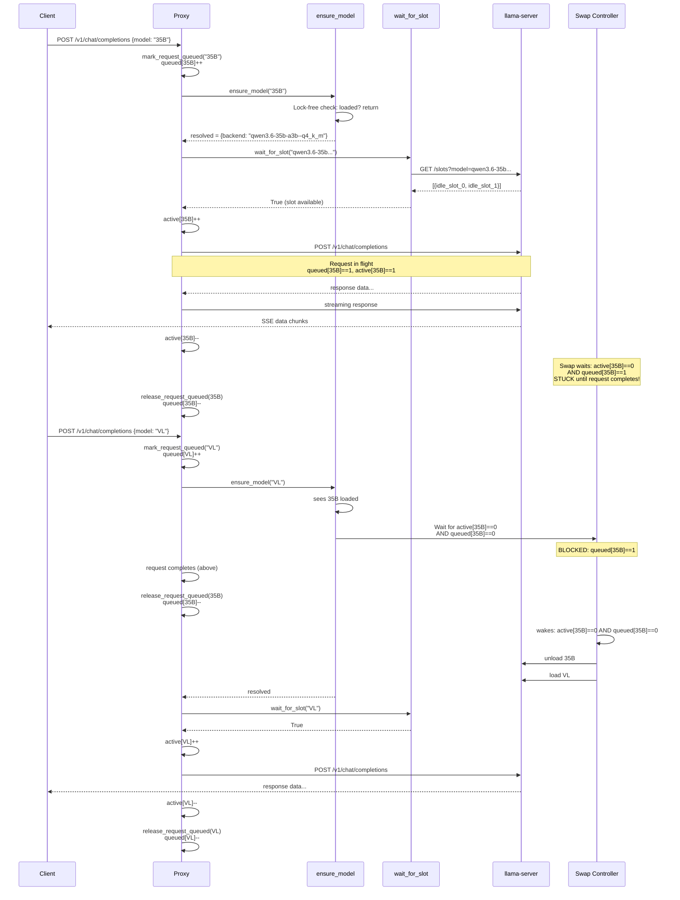
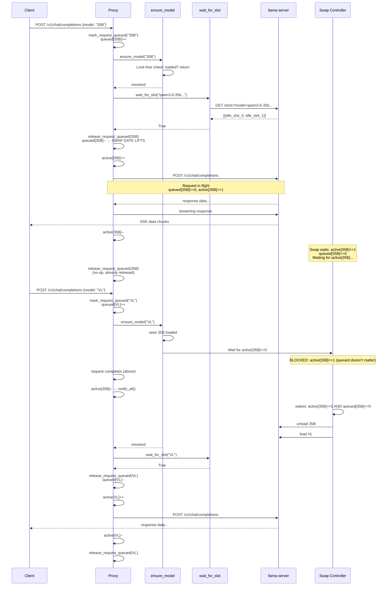

# Slot, Queue & Model Swap Architecture

## Data Structures

| Variable | Type | Purpose |
|----------|------|---------|
| `active_requests: dict[str, int]` | `dict<backend_model, count>` | In-flight HTTP requests per model |
| `queued_requests: dict[str, int]` | `dict<backend_model, count>` | Requests that have been "admitted" (past `mark_request_queued` but before slot confirmed) |
| `active_requests_lock` | `asyncio.Condition` | Guards both dicts; `wait()`/`notify_all()` for swap coordination |
| `router_model_lock` | (separate) | Serializes all model load/unload operations |

## Core Functions

### `mark_request_queued(model_name)` (line 117)
- Resolves `model_name` → `backend_model` via router manifest
- Increments `queued_requests[backend_model]`
- Prevents model swap-out while request is being admitted
- Returns `backend_model` for later pairing with `release_request_queued`

### `release_request_queued(backend)` (line 141)
- Decrements `queued_requests[backend]`
- Calls `notify_all()` to wake swap-waiters

### `ensure_model(model_name)` (line 5648)
- Lock-free check: if model already loaded + healthy, return immediately
- Acquires `router_model_lock`, increments `active_requests[backend_model]`
- Calls `_ensure_model_impl()` which handles model swapping:
  - With `MAX_LOADED_MODELS=1`: if another model is loaded, waits for **both** `active_requests[other]==0` AND `queued_requests[other]==0` before unloading
  - Unloads the other model via router API
- Decrements `active_requests[backend_model]` in `finally`

### `wait_for_slot(backend_model)` (line 6564)
- Polls llama-server `GET /slots?model={backend_model}`
- Returns `True` when at least one slot exists and not all are `is_processing=True`
- Uses exponential backoff (0.1s to 1.0s) between polls, timeout default 120s

### `_fetch_model_slots(model_id)` (line 7709)
- Queries llama-server `GET /slots?model={model_id}`
- Normalizes response shape (list of dicts, list of strings, or error dict)
- Returns `[]` on failure or when model is not loaded

## Request Flow (`/v1/chat/completions` and variants)

```
Client request arrives
    │
    ▼
1. mark_request_queued(model_name)
   → queued_requests[backend]++
   │
    ▼
2. ensure_model(model_name)
   → Lock-free check: already loaded? return immediately.
   → Acquire router_model_lock
   → Increment active_requests[backend] (in ensure_model, decremented in finally)
   → _ensure_model_impl():
       If MAX_LOADED_MODELS==1 and another model loaded:
           Wait for active_requests[other]==0 AND queued_requests[other]==0 (180s timeout)
           Unload other model
   → Decrement active_requests[backend] in finally
   │
    ▼
3. wait_for_slot(backend_model)
   → Poll llama-server /slots?model={backend_model}
   → Wait until at least one idle slot exists
   │
    ▼
4. active_requests[backend]++  (before HTTP request)
   │
    ▼
5. POST to llama-server /v1/chat/completions
   │
    ▼
6. active_requests[backend]--
   → notify_all()  (wakes swap-waiters)
   │
    ▼
7. release_request_queued(queued_backend)
   → queued_requests[backend]--
   → notify_all()
```

## Model Swap Sequence

When a request for model Y arrives while model X is loaded:

```
ensure_model(Y) called:
    router_model_lock ACQUIRED
    │
    ▼
    sees X is loaded
    │
    ▼
    Wait loop: active_requests[X]==0 AND queued_requests[X]==0
    ┌──────────────────────────────────────────────┐
    │  If either > 0:                               │
    │    Wait up to 180s (notify on condition change)│
    │    On timeout: force unload                   │
    └──────────────────────────────────────────────┘
    │
    ▼
    Unload X via router API
    │
    ▼
    Load Y
    │
    ▼
    Release router_model_lock
```

## Critical Semantics

### What `queued_requests` is for:
A "swap blocker" — prevents another model from unloading this model while a request is being admitted. Once the slot is confirmed (after `wait_for_slot`), the request has its own model loaded and no swap can affect it.

### What `active_requests` is for:
An "in-flight counter" — prevents another model from unloading while this model is actively processing requests on llama-server.

### The Problem:
Currently `release_request_queued` is called in the `finally` block of the **entire request handler** — meaning `queued_requests[backend]` stays > 0 for the **entire request lifetime**, not just the admission window.

```
OLD: queued[X]++ (line 1873) ... ensure_model ... wait_for_slot ... sent to server ...
     request completes ... finally: release_request_queued (line 2116) ... queued[X]--
     ↑────────────────────────────── queued[X] stays > 0 for entire request ────────────────────────────────────┘
```

This means a swap for model Y waits for the entire duration of an in-flight request for model X — which is redundant because `active_requests[X]` already blocks the swap during that time.

### The Fix:
Call `release_request_queued` **after** `wait_for_slot` returns (slot confirmed), not at request completion.

```
NEW: queued[X]++ → ensure_model → wait_for_slot → release_request_queued (slot confirmed!)
     → active[X]++ → send to server → active[X]-- → finally: release (no-op)
     └─────────── queued[X] only > 0 during admission window ───────────┘
```

## Request Flow After Fix

```
Client request arrives
    │
    ▼
1. mark_request_queued(model_name)
   → queued_requests[backend]++
   │
    ▼
2. ensure_model(model_name)
   → Lock-free check: already loaded? return immediately.
   → Acquire router_model_lock
   → Increment active_requests[backend] (in ensure_model, decremented in finally)
   → _ensure_model_impl():
       If MAX_LOADED_MODELS==1 and another model loaded:
           Wait for active_requests[other]==0 AND queued_requests[other]==0
           Unload other model
   → Decrement active_requests[backend] in finally
   │
    ▼
3. wait_for_slot(backend_model)
   → Poll llama-server /slots?model={backend_model}
   → Wait until at least one idle slot exists
   │
    ▼
4. release_request_queued(queued_backend)  ← NEW: swap gate lifts here
   → queued_requests[backend]--
   │
    ▼
5. active_requests[backend]++
   │
    ▼
6. POST to llama-server /v1/chat/completions
   │
    ▼
7. active_requests[backend]--
   → notify_all()
   │
    ▼
8. release_request_queued(queued_backend)  ← no-op (backend already released)
```

## Scenario Analysis

### Scenario 1: Single model, multiple requests
```
35B loaded
Request A: queued[35B]++ → ensure_model → wait_for_slot → release queued → active[35B]++ → in-flight → active[35B]-- → release (no-op)
Request B: queued[35B]++ → ensure_model (already loaded) → wait_for_slot → release queued → active[35B]++ → in-flight → active[35B]-- → release (no-op)
```
**No change** — both proceed normally, same behavior.

### Scenario 2: 35B in-flight, VL requested
```
35B loaded, Request A (35B) in-flight (active[35B]==1)
Request B (VL): queued[VL]++ → ensure_model(VL):
  sees 35B loaded
  waits: active[35B]==1 → BLOCKED
Request A completes: active[35B]-- → notify_all()
ensure_model(VL) wakes: queued[35B]==0 AND active[35B]==0 → unload 35B, load VL
  wait_for_slot(VL)
  release queued[VL]
  active[VL]++ → in-flight
```
**Correct behavior** — B waits for A to finish, then swaps. No change in outcome.

### Scenario 3: VL swap triggered while 35B request is between steps 4-5 (tiny race window)
```
Request A (35B): ... release queued[35B] (step 4) → [context switch] → active[35B]++ (step 5)
Request B (VL):  ... ensure_model(VL): sees active[35B]==0 AND queued[35B]==0 → swap!
Request A:     → active[35B]++ → POST to llama-server → model unloaded → error → retry
```
**Microsecond race** — swap kicks in fraction of a second early. Recovery via retry logic.
**Impact:** Minimal — llama-server returns error for unloaded model, ensure_model retries, loads model.
**Mitigation:** The window is between two adjacent lines of code — effectively microseconds.

### Scenario 4: Two different model requests arrive simultaneously
```
35B loaded, idle
Request A (VL): queued[VL]++ → ensure_model(VL): sees 35B, waits for queued[35B]==0
Request B (35B): queued[35B]++ → ensure_model(35B): already loaded, returns immediately
                 → wait_for_slot(35B) → release queued[35B]
                 → active[35B]++ → in-flight
Request A (VL): queued[35B] still > 0, still waits
Request B (35B) completes: active[35B]-- → notify_all()
Request A (VL): wakes, queued[35B]==0 AND active[35B]==0 → swap
```
**Correct** — VL waits for 35B in-flight to finish. No change.

### Scenario 5: The bug being fixed — stale queued_requests blocking swaps
```
35B loaded
Request A (35B) completes its ensure_model + wait_for_slot but is still processing
  queued[35B] is still > 0 (will be released when request completes)
Request B (VL): queued[VL]++ → ensure_model(VL):
  sees 35B loaded
  waits: active[35B]==1 (A is in-flight) AND queued[35B]==1 (A's stale count)
  → waits for A to complete
A completes: active[35B]-- → notify_all()
  queued[35B] still == 1!
ensure_model(VL) wakes: active[35B]==0 BUT queued[35B]==1 → STUCK!
  → waits 180s then force-unloads
```
**With fix:** `release_request_queued` called after `wait_for_slot`, so `queued[35B]==0` as soon as A's slot is confirmed. Swap proceeds immediately after A finishes in-flight.

## Endpoint Locations

All 4 entry points follow the same pattern and need the fix:

| Endpoint | Line | Stream Path | Non-Stream Path |
|----------|------|-------------|-----------------|
| `/v1/chat/completions` | 1849 | `release_request_queued` in `stream_proxy` finally (line 2022) | `release_request_queued` in `finally` (line 2116) |
| `/v1/completions` | 2148 | `release_request_queued` in `stream_proxy` finally (line 2304) | `release_request_queued` in `finally` (line 2378) |
| `/api/chat` | 6746 | `release_request_queued` in `stream_proxy` finally (line 7029) | `release_request_queued` in `finally` (line 7175) |
| `/api/generate` | 7179 | `release_request_queued` in `stream_proxy` finally (line 7175) | `release_request_queued` in `finally` (lines 7646-7650) |

## Fix Strategy

For each endpoint:

1. **Stream path:** Move `release_request_queued` from `stream_proxy`'s `finally` to right after `wait_for_slot` returns (before the HTTP request). The existing `finally` call becomes a no-op (already released).

2. **Non-stream path:** Move `release_request_queued` from `finally` to right after `wait_for_slot` returns (before the HTTP request). The existing `finally` call becomes a no-op.

3. **Error/timeout paths:** Keep `release_request_queued` in early-exit paths (model not found, queue timeout).

4. **Retry paths:** The retry logic inside `ensure_model` calls (`await ensure_model(model_name)` in except blocks) should **not** re-increment `queued_requests` — they should use the already-resolved backend.

## Mermaid Diagrams

### Current Flow (Before Fix)



### After Fix



### Swap Timing Comparison

```mermaid
gantt
    title Swap Timing: Before Fix (left) vs After Fix (right)
    dateFormat X
    axisFormat %s
    
    section BEFORE FIX
    Request A (35B) in-flight :a1, 0, 3000
    queued[35B] > 0 (entire request) :a2, 0, 3000
    active[35B] > 0 :a3, 0, 3000
    VL request queued :a4, 1000, 2500
    Swap blocked (queued==1) :a5, 1000, 1500
    Swap blocked (active==1) :a6, 1000, 3000
    Swap proceeds :a7, 3000, 4000
    
    section AFTER FIX
    Request A (35B) in-flight :b1, 0, 3000
    queued[35B] > 0 (admission only) :b2, 0, 100
    active[35B] > 0 :b3, 0, 3000
    Release queued :b4, 100, 200
    Swap gate lifted :b5, 200, 300
    VL request queued :b6, 1000, 2000
    Swap blocked (active==1) :b7, 1000, 3000
    Swap proceeds immediately :b8, 3000, 4000
```


